# Playing with Conics and OpenGL on OS X

Welcome.  These are code sketches relating to conic sections and OpenGL.  It's all very humble and intentionally non-exemplary.  I just want to get some ideas out there that have been on my mind for a long time.  We can do better with our math textbooks, don't you think?


It would be nice to have a couple different views on the same thing.  Maybe 2D in one window and 3D in the other.  The follow is a stripped down version of some [nice code](http://study.marearts.com/2012/01/sample-source-to-make-subwindow-in.html) from JH Kim:

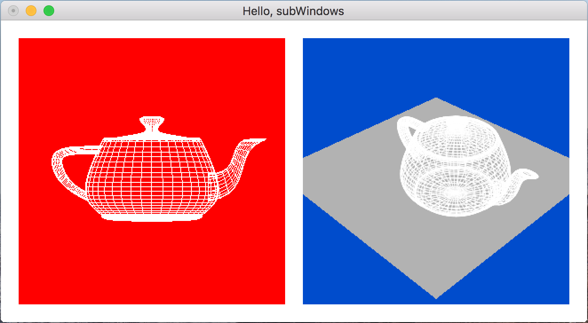

Oh, some text would be good too.  For now, I'm happy to get bitmapped text rendering.  When I'm ready to be fancy, I'll switch to strocked fonts.

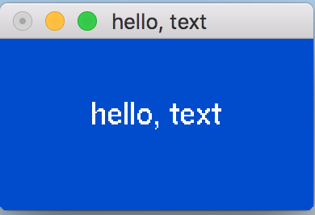

A window that maintains overall aspect ratio even when it is resized would be useful, especially with math where we don't want to distort our rendered curves.

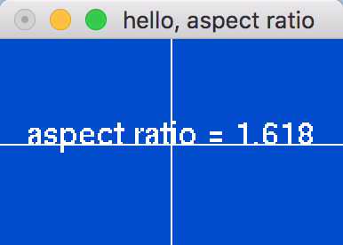

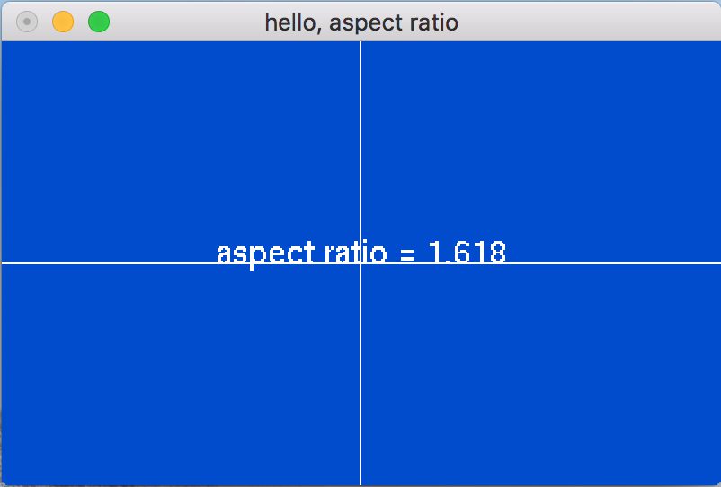

Make it easy to change the aspect ratio, too.

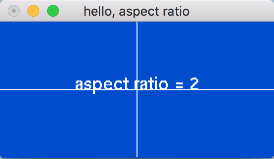

And it would be nice to leverage some OpenGL primitives (like glMap1f() and glEvalCoord1f()) to render an actual conic:

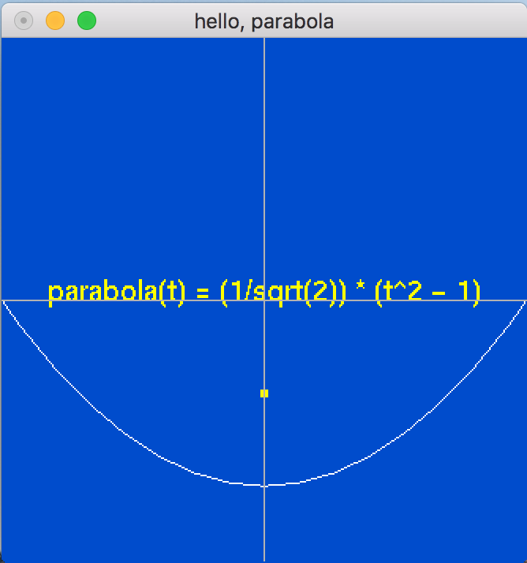

```
    // Configure a map to support downstream evaluation of
    // a 3rd order Bezier curve.

    //          +-- Triggers generation of glVertex3 commands by evaluator.
    //          |
    //          |              +-- min parametric value
    //          |              |
    //          |              |    +-- max parametric value
    //          |              |    |
    //          |              |    |   +-- stride, # of values between gBezierControlPoints.
    //          |              |    |   |   So a 3d control point will have x, y, z
    //          |              |    |   |   values between control point boundaries,
    //          |              |    |   |   or a stride of 3
    //          |              |    |   |
    //          |              |    |   |  +-- number of control points
    //          |              |    |   |  |
    //          |              |    |   |  |   +-- ptr to array of control points
    //          |              |    |   |  |   |

    glMap1f(GL_MAP1_VERTEX_3, 0.0, 1.0, 3, 4, &gBezierControlPoints[0][0]);
    glEnable(GL_MAP1_VERTEX_3);

    ...

   glBegin(GL_LINE_STRIP);
      //
      // Subdivide the curve into steps between the min and max
      // parametric values, evaluating the curve as we go and
      // issuing corresponding glVertex3 calls.
      //
      // Within a GL_LINE_STRIP context, effect is to join points
      // along the curve by straight lines, approximating the
      // overall curve.
      //
      for (i = 0; i <= 30; i++)
         glEvalCoord1f((GLfloat) i/30.0);
   glEnd();
```

Render a 2D and 3D parabola.  Illumination obviously needs some work, but incrementally interesting.

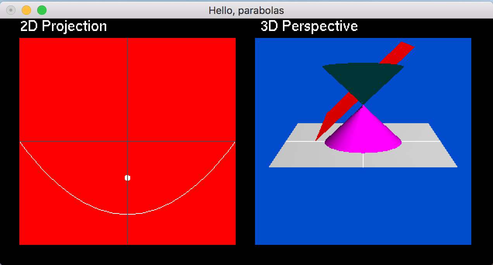

Better 3D parabola with transparency.

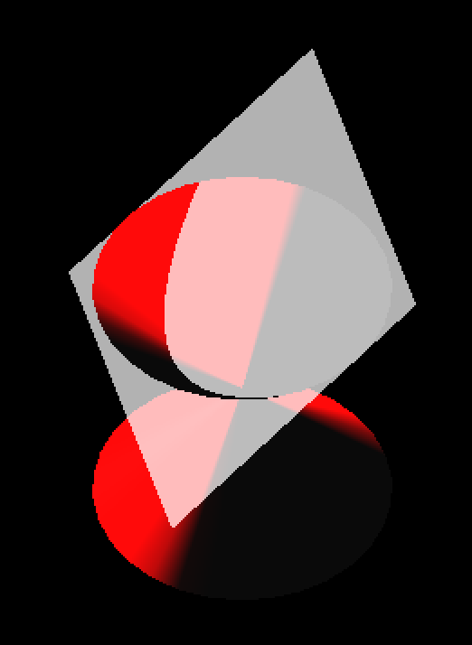

Start exploring how to mix user-interface elements with OpenGL graphics, courtesy [GLUI](https://github.com/libglui/glui) and Paul Rademacher, et al.

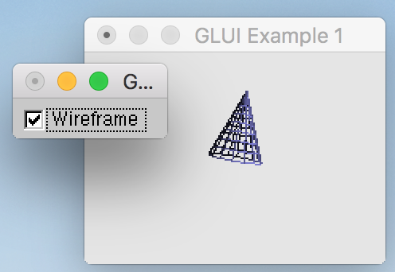

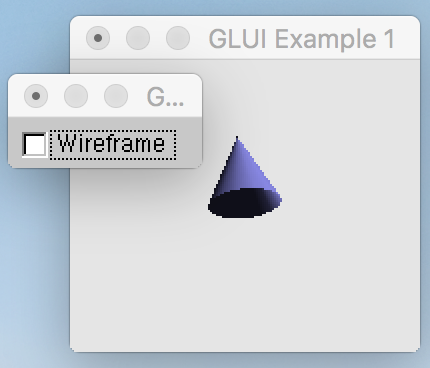

Getting libglui to build required digging into [cmake](https://cmake.org).


And here are the rudiments of a nice little user interface, ready to modify.

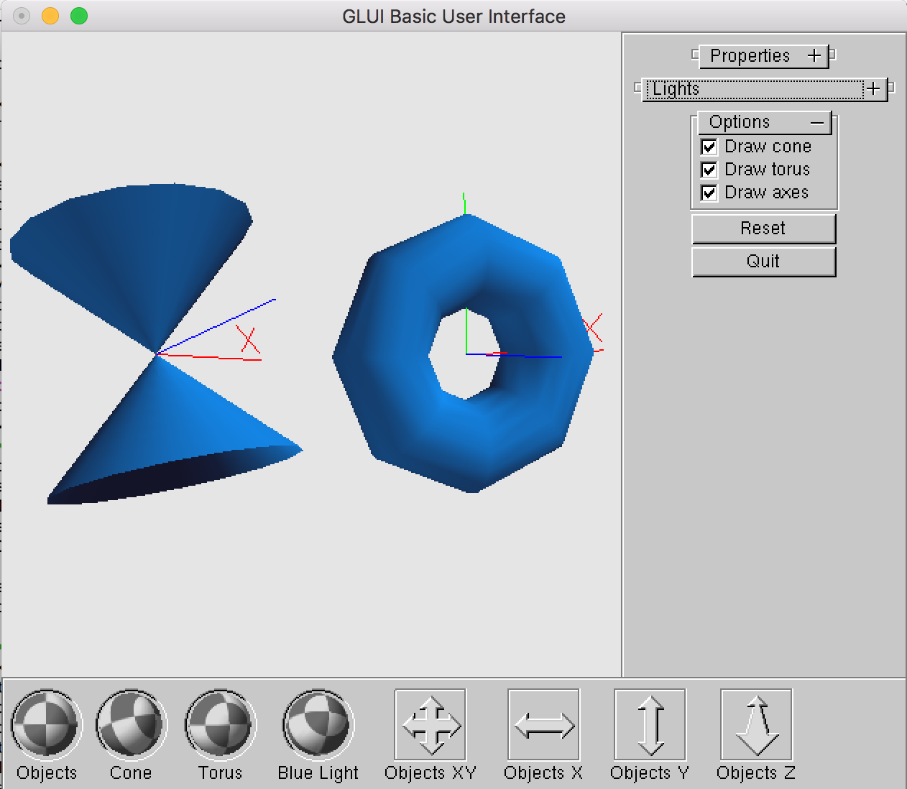

Teach a plane to intersect a cone at any angle and offset to make conics sections.

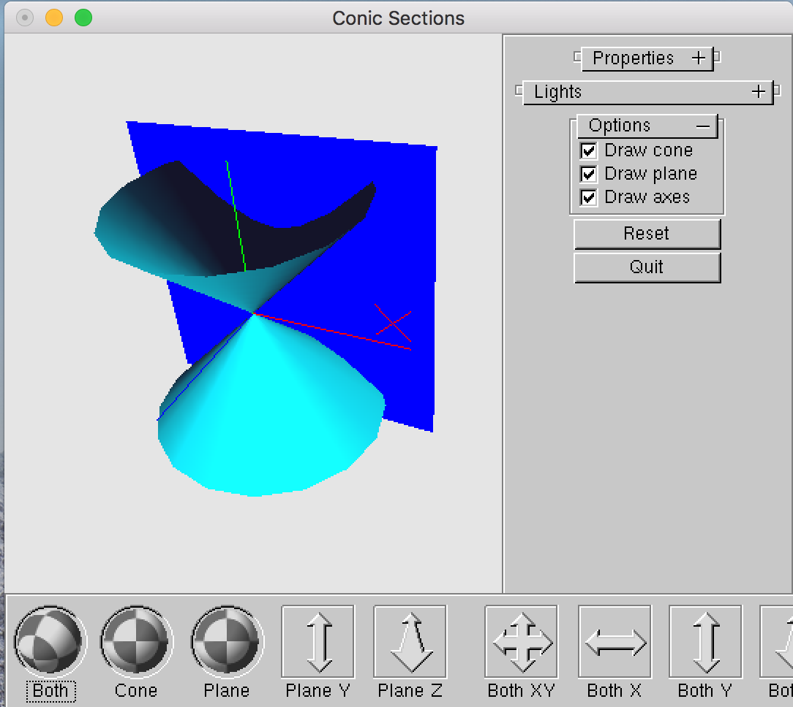

Add slider control for variable cone generator angle.

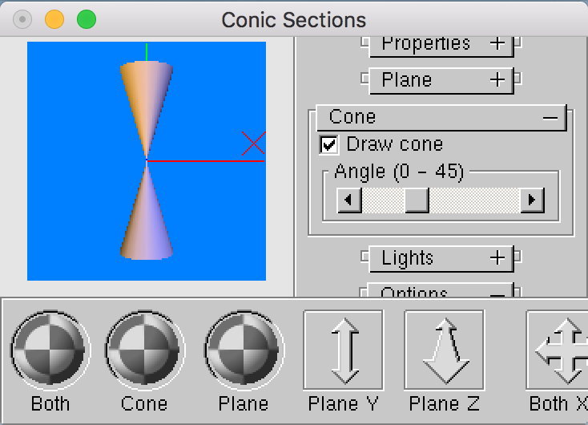
