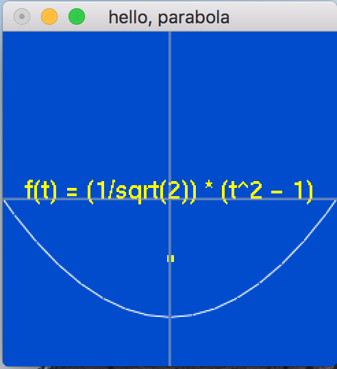

# Playing with Conics and OpenGL on OS X

Welcome.  These are code sketches relating to conic sections and OpenGL.  It's all very humble and intentionally non-exemplary.  I just want to get some ideas out there that have been on my mind for a long time.  We can do better with our math textbooks, don't you think?

It would be nice to have a couple different views on the same thing.  Maybe 3D in one window and a 2D projection in the other.

Oh, some text would be good too.  For now, I'm happy to get bitmapped text rendering.  When I'm ready to be fancy, I'll switch to strocked fonts.

And it would be nice to leverage some OpenGL primitives (like glMap1f() and glEvalCoord1f()) to render an actual conic:

